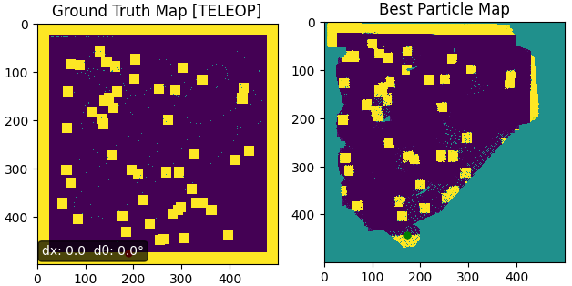

# FastSLAM 1.0 Minimal Implementation

A particle filter-based implementation of the FastSLAM algorithm for simultaneous localization and mapping (SLAM). Each particle maintains its own pose estimate and occupancy grid map for robust real-time mapping.



## Features

- **Particle Filter Approach**: Uses multiple particles to represent pose uncertainty
- **Occupancy Grid Mapping**: Each particle maintains a log-odds occupancy grid
- **Motion Model**: Noisy motion prediction with customizable noise parameters
- **Measurement Update**: Likelihood-based weight updates from sensor observations
- **Adaptive Resampling**: Systematic resampling based on effective sample size
- **Log-Odds Fusion**: Stable map updates with measurement confidence filtering
- **Optimized Performance**: Vectorized operations for real-time performance (>10 Hz)

## TODO
- Add support for different sensor models
- Add configuration file support
- Implement map saving/loading functionality

## How to Run

1. **Clone the repository:**
   ```bash
   git clone https://github.com/Ilyes-Origamist/FastSLAM-Tests/
   ```

2. **Install dependencies:**
    ```bash
    pip install numpy scipy matplotlib
    ```

3. **Run the FastSLAM algorithm:**
   ```bash
   python main.py
   ```

4. **Configuration:**
   - Adjust parameters in `config.py` (number of particles, noise levels, etc.)
   - Modify sensor input source in `FastSLAM_main.py`

## Documentation

For detailed algorithm information, see [docs/FastSLAM1_summary.md](docs/FastSLAM1_summary.md).